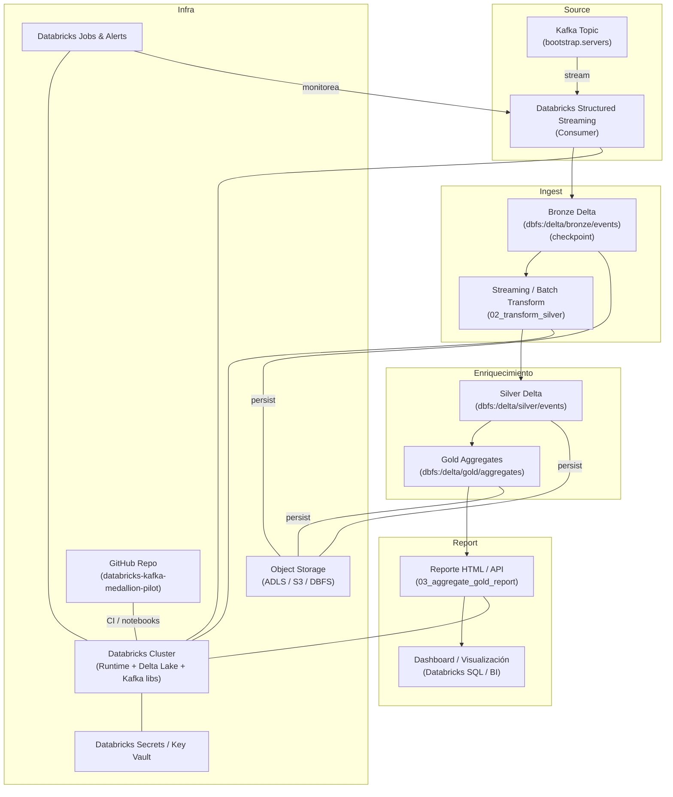

# Diagrama de Arquitectura — Flujo de Datos

```mermaid
flowchart TD
  subgraph Source
    A["Kafka Topic<br/>(bootstrap.servers)"] -->|stream| B["Databricks Structured Streaming<br/>(Consumer)"]
  end

  subgraph Ingest
    B --> C["Bronze Delta<br/>(dbfs:/delta/bronze/events)<br/>(checkpoint)"]
    C --> D["Streaming / Batch Transform<br/>(02_transform_silver)"]
  end

  subgraph Enriquecimiento
    D --> E["Silver Delta<br/>(dbfs:/delta/silver/events)"]
    E --> F["Gold Aggregates<br/>(dbfs:/delta/gold/aggregates)"]
  end

  subgraph Report
    F --> G["Reporte HTML / API<br/>(03_aggregate_gold_report)"]
    G --> H["Dashboard / Visualización<br/>(Databricks SQL / BI)"]
  end

  subgraph Infra
    I["Object Storage<br/>(ADLS / S3 / DBFS)"]
    J["Databricks Cluster<br/>(Runtime + Delta Lake + Kafka libs)"]
    K["Databricks Jobs & Alerts"]
    L["Databricks Secrets / Key Vault"]
    M["GitHub Repo<br/>(databricks-kafka-medallion-pilot)"]
  end

  C ---|persist| I
  E ---|persist| I
  F ---|persist| I
  B --- J
  D --- J
  G --- J
  J --- L
  M ---|CI / notebooks| J
  K --- J
  K -->|monitorea| B
```

Descripción: Kafka → Ingest (Streaming) → Bronze → Transform → Silver → Agregación → Gold → Reporte/Visualización.
